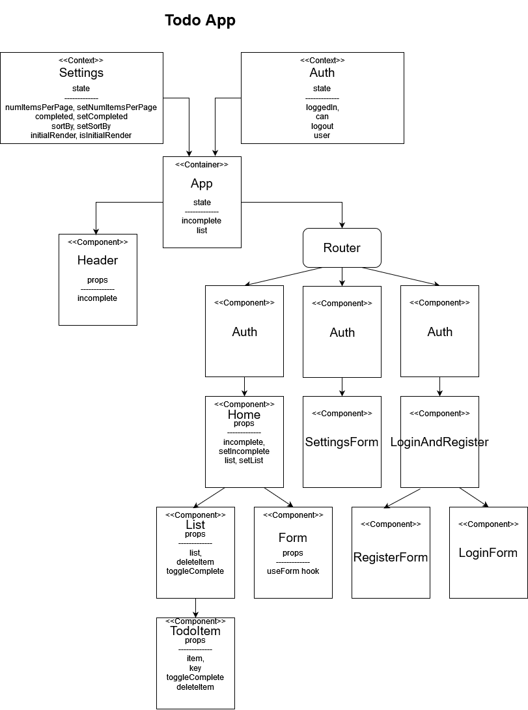

# Todo-app

A Web Application for securely managing a To Do List

## Requirements

### Phase 1 Application Setup

* Implement basic To Do List Management, using Hooks

* Style the application using the Blueprint Component API

* Properly modularize the application into separate components

* Implement the Context API to make some basic application settings available to components
  * How many todo Items to show at once
  * Whether or not to show completed todo items
  * Which sort to apply to todo items

### Phase 2 User Settings Config

* Provide the users with a form where they can change the values for those settings

* Save the users choices in Local Storage
  * Retrieve their preferences from Local Storage and apply them to the application on startup

### Phase 3 Auth

* Provide a way for users to create new accounts

* Provide a way for users to login to their existing accounts

* Ensure todo items are only viewable by logged in users

* Ensure todo item form and settings page are only viewable by logged in users.

* Add Role based access control to ensure users can only create, update, or delete todo items if they have a role with the proper capabilities (For this phase, a the default user role will have all these capabilities)

------------

### Assignment Notes

* For the purpose of this assignment there was no data persistence outside of storing settings context values to local-storage. There was also no encryption of passwords, or any type of backend.

#### Global State

* This application manages global state by using the React Context API. An instance of this API related to application theming was created. This design decision was made since such values did not need to change during program execution. The related Setting Context's and Auth Context's Providers wrapped the entire application. Consumers used the useContext hook to obtain the necessary global state values.

#### Custom Hooks

* The custom useForm hook was created to add highly reusable form actions. The handleChange method first called event.persist to allow the program to access a syntethic event inside an async callback function. Then it could modify its value state using the useState hook without any side effects. The handleSubmit function allowed a submission to be done with any callback function that was passed into the hook, if an event was present.

### Deployment

  _Live application code found [here](https://beers15.github.io/todo-app/)_

### Diagram

